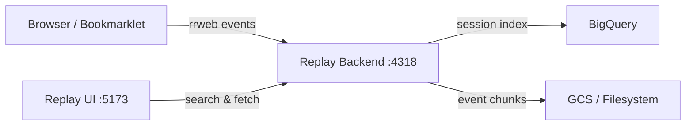
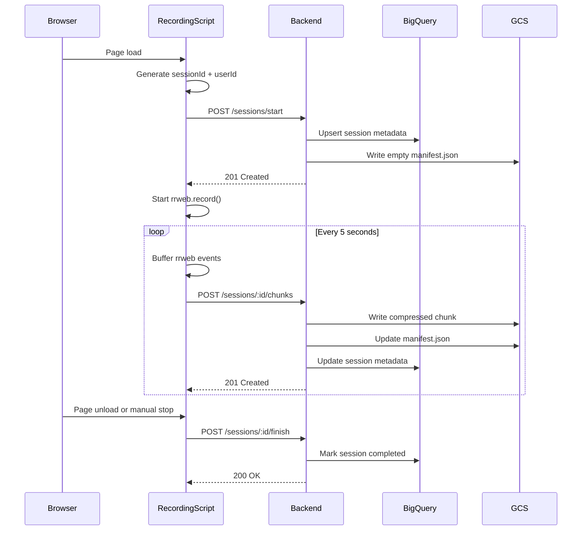
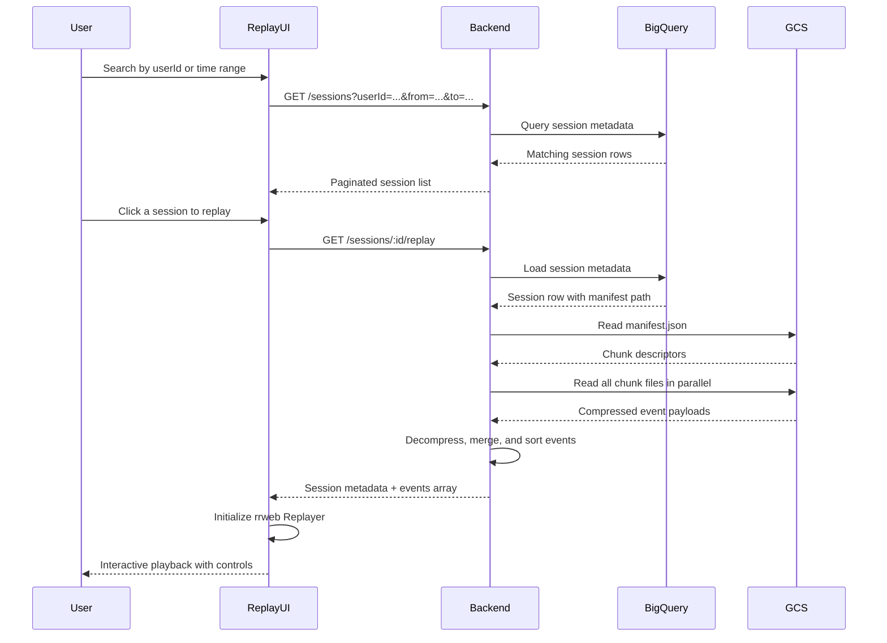

# rrweb-bigquery

## Original rrweb documents

**[📚 Read the rrweb guide here. 📚](./guide.md)**

**[🍳 Recipes 🍳](./docs/recipes/index.md)**

**[📺 Presentation:** Hacking the browser to digital twin your users 📺](https://youtu.be/cWxpp9HwLYw)

## Project Structure

rrweb is mainly composed of 3 parts:

- **[rrweb-snapshot](https://github.com/rrweb-io/rrweb/tree/master/packages/rrweb-snapshot/)**, including both snapshot and rebuilding features. The snapshot is used to convert the DOM and its state into a serializable data structure with a unique identifier; the rebuilding feature is to rebuild the snapshot into corresponding DOM.
- **[rrweb](https://github.com/rrweb-io/rrweb)**, including two functions, record and replay. The record function is used to record all the mutations in the DOM; the replay is to replay the recorded mutations one by one according to the corresponding timestamp.
- **[rrweb-player](https://github.com/rrweb-io/rrweb/tree/master/packages/rrweb-player/)**, is a player UI for rrweb, providing GUI-based functions like pause, fast-forward, drag and drop to play at any time.

Demo Video:
"https://www.youtube.com/embed/1MDFuzmIock" 


## Modifcations in this experimental version

BigQuery Replay Stack

This fork adds a full session recording and replay pipeline backed by Google BigQuery and Google Cloud Storage. It allows you to record user sessions from any website, store them durably, search by user or time, and replay them in a dedicated UI. This is a EXPERIMENTAL version and not production ready! Do not use in production!

### Architecture



### New Packages

| Package                            | Path                                 | Purpose                                                                                                        |
| ---------------------------------- | ------------------------------------ | -------------------------------------------------------------------------------------------------------------- |
| `@rrweb/bigquery-replay-contracts` | `packages/bigquery-replay-contracts` | Shared TypeScript types, schemas, and helpers used by all parts of the stack                                   |
| `@rrweb/bigquery-replay-recorder`  | `packages/bigquery-replay-recorder`  | Client-side recorder wrapper that buffers rrweb events and uploads chunks to the backend                       |
| `@rrweb/bigquery-replay-backend`   | `packages/bigquery-replay-backend`   | Fastify API server that ingests sessions, stores chunks in GCS or filesystem, and indexes metadata in BigQuery |
| `@rrweb/bigquery-replay-app`       | `packages/bigquery-replay-app`       | React/Vite replay UI with session search, filtering, and rrweb playback                                        |

### Recording Flow



### Replay Flow



### Quick Start

1. Set environment variables:

```bash
export SESSION_INDEX_DRIVER=bigquery
export OBJECT_STORE_DRIVER=gcs
export BIGQUERY_DATASET=rrweb_replay
export BIGQUERY_TABLE=sessions
export GCS_BUCKET=your-bucket
export GOOGLE_APPLICATION_CREDENTIALS=/path/to/service-key.json
```

1. Start the backend:

```bash
yarn workspace @rrweb/bigquery-replay-backend start
```

1. Start the replay UI:

```bash
yarn workspace @rrweb/bigquery-replay-app dev
```

1. Inject recording via bookmarklet or embed the recording script in any page. Events are sent to `http://localhost:4318`.
2. Open `http://localhost:5173` to search and replay sessions.

### Data Storage Split

**BigQuery** stores searchable session metadata: `sessionId`, `userId`, `startedAt`, `endedAt`, `durationMs`, `status`, `eventCount`, `chunkCount`, page URL, app version, environment, and tags.

**GCS or Filesystem** stores the heavy replay data: `manifest.json` (chunk index) and gzip-compressed event chunk files like `000000.json.gz`.

This separation keeps BigQuery fast for queries while storing arbitrarily large event payloads in object storage.

### Additional Documentation

- [BigQuery local and GCP test guide](./docs/bigquery-local-and-gcp-test-guide.md)
- [Replay sequence diagrams](./docs/replay-sequence-bigquery-storage.md)
- [Backend README](./packages/bigquery-replay-backend/README.md)

## Roadmap

- Add production oauth support for the recording and replay
- Release a productionalizable version
