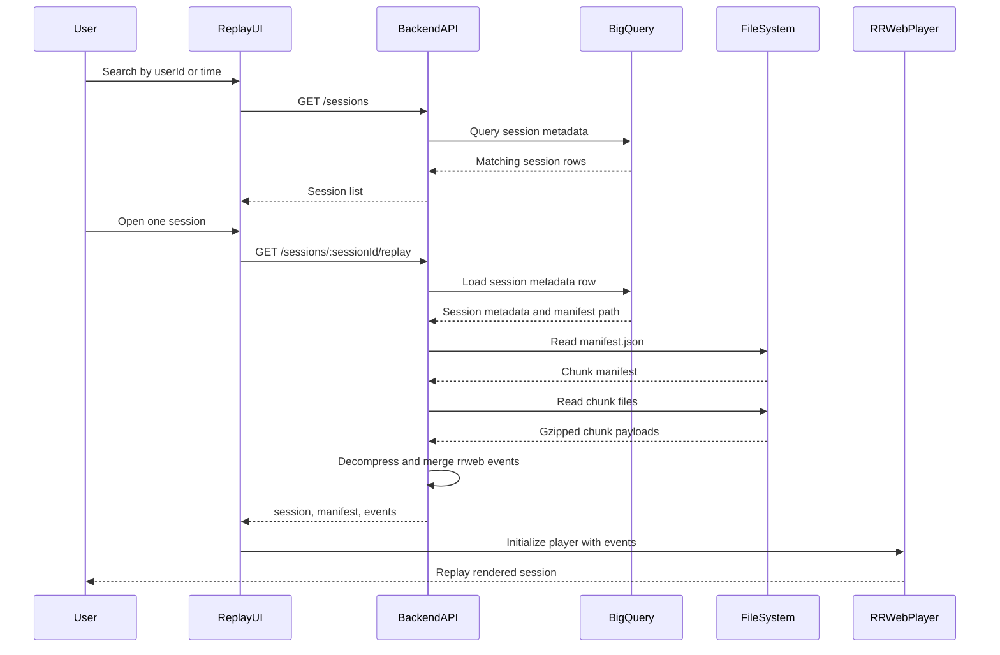
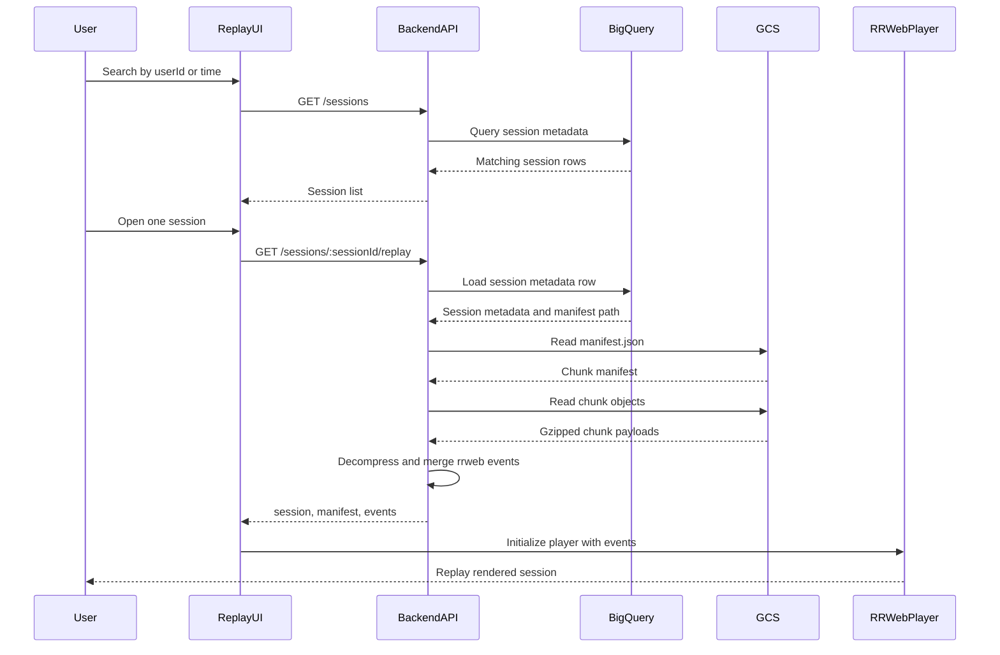
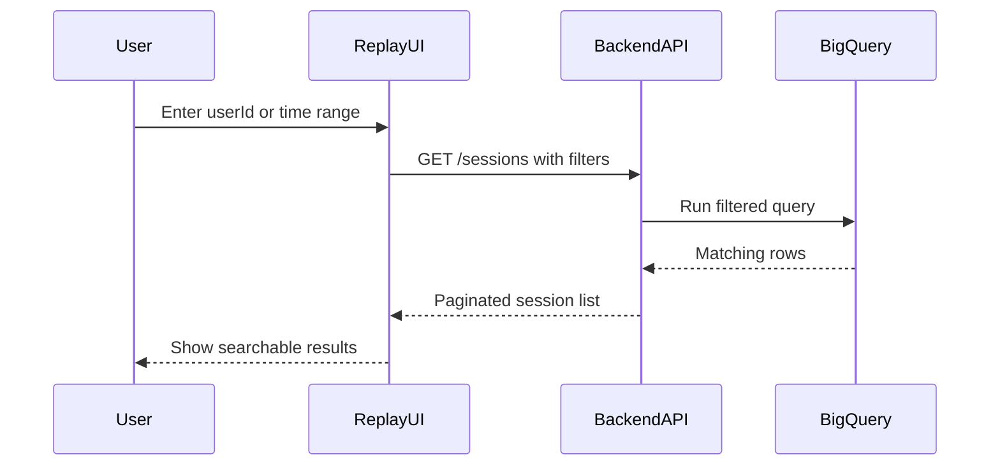

# Replay Sequence Diagrams

This document shows how replay works when session metadata is stored in BigQuery and replay chunks are stored in either:

1. local filesystem
2. Google Cloud Storage

## Overview

In this design:

- BigQuery stores searchable session metadata
- replay chunks are stored separately as chunk blobs
- the replay UI searches by `userId` or time
- the backend reads metadata from BigQuery
- the backend reads replay chunk data from filesystem or GCS
- the backend returns hydrated rrweb events to the replay UI
- the replay UI renders those events with `rrweb-player`

## Replay With BigQuery + Filesystem

## Replay With BigQuery + GCS

## Search Flow

The search flow is the same for both storage modes because search is driven by BigQuery.

## Data Responsibility Split

### BigQuery stores

- `sessionId`
- `userId`
- `startedAt`
- `endedAt`
- `durationMs`
- `status`
- `eventCount`
- `chunkCount`
- `storagePrefix`
- `manifestPath`
- optional page/app/environment metadata

### Filesystem or GCS stores

- `manifest.json`
- replay chunk blobs such as `000000.json.gz`
- the actual rrweb event payloads used for replay

## Why replay is designed this way

This architecture avoids storing heavy rrweb payloads directly in BigQuery.

Benefits:

- BigQuery remains fast for search and filtering
- replay blobs can be compressed efficiently
- chunk storage is append-friendly
- replay reads are deterministic through `manifest.json`

## High-Level Replay Steps

1. User searches for sessions in the replay UI.
2. Backend queries BigQuery for matching metadata rows.
3. User selects a session.
4. Backend loads the session row from BigQuery.
5. Backend reads `manifest.json` from filesystem or GCS.
6. Backend reads all referenced chunk blobs.
7. Backend decompresses and merges rrweb events.
8. Backend returns hydrated replay payload to the UI.
9. `rrweb-player` renders the replay in the browser.

## Filesystem vs GCS Difference

The replay flow is almost identical. The only difference is where the backend reads chunk data from:

- filesystem mode:
  - local disk on the backend host
- GCS mode:
  - Google Cloud Storage bucket

BigQuery stays the same in both designs.
